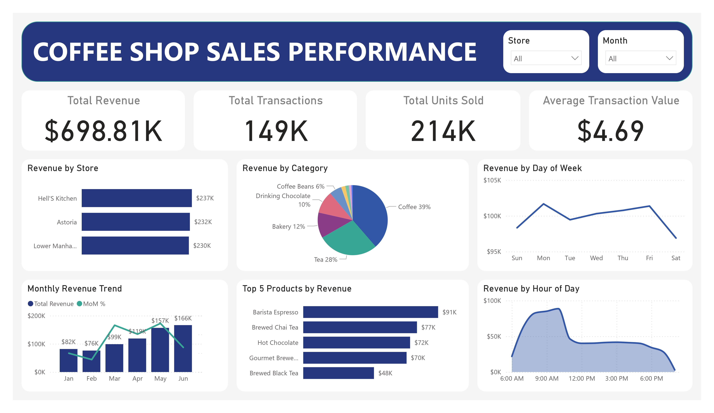

# ☕ Coffee Shop Sales Performance & Store Benchmarking Dashboard  
## 📌 Project Overview  
Developed an **interactive Power BI dashboard** analyzing **149K+ transactions** from a coffee shop chain with **3 locations** over **6 months**.  
The dashboard provides **store benchmarking, revenue growth tracking, product performance insights, and customer behavior analysis** to support strategic decision-making.  

---

## 🎯 Business Objectives  
1. Benchmark store performance across revenue and average spend.  
2. Identify top-performing categories and products driving revenue.  
3. Analyze time-based sales patterns (day-of-week and hour-of-day).  

---

## 🛠 Tools & Skills 
- **Power BI** → Dashboard design, slicers, MoM trend overlay, KPI visualization  
- **Power Query** → Data cleaning, transformations, feature engineering 
- **DAX** → Custom measures for Total Revenue, Total Transactions, Total Units Sold, Average Transaction Value, and Month-over-Month growth.
- **Data Modeling** → Date table, relationships, time intelligence functions  
- **Business Analysis** → Translating raw transaction data into actionable insights for strategic decision-making.   

---

## 🗂 Dataset  
- **Source:** This dataset was sourced from the [Maven Analytics Data Playground](https://mavenanalytics.io/data-playground/coffee-shop-sales).  
- **Size:** 149,116 records, 11 fields  
- **Key Fields:**
  - `transaction_id` - Unique ID per transaction
  - `transaction_date` -  Date of the transaction
  - `transaction_time` - Timestamp of the transaction
  - `transaction_qty` - Quantity of items sold
  - `store_location` - Coffee shop location
  - `unit_price` - Retail price of the product sold
  - `product_category`,`product_type`,`product_detail` - Product attributes
- **Derived Metrics:**  
  - `revenue` = `transaction_qty` × `unit_price`  
  - Date/Time breakdowns: `Month`, `Day`, `Hour`  

---

## 🧹 Data Cleaning & Processing

All data preparation was performed in **Power BI (Power Query)** before analysis and visualization.  

### 1. Data Quality Checks & Improvements  
- **Removed duplicates** from `transaction_id` ensure uniqueness of transactions.  
- Checked for missing/null values in key fields (`store_location`, `product_category`, `unit_price`).  
- Validated numeric fields: ensured `transaction_qty` and `unit_price` contained no negative or invalid values. 
- **Changed data types**:  
  - Ensured `transaction_date` was in **Date** format.  
  - Converted `transaction_time` into proper **Time** format.  

### 2. Standardization & Formatting  
- Applied **Trim()** & **Proper()** functions to clean and standardize text fields (`store_location`,`product_category`,`product_type`,`product_detail`) preventing mismatches.	

### 3. Feature Engineering  
- Extracted date-based fields from `transaction_date`:  
  - `Month` → for monthly revenue trends  
  - `Day Name` → for weekday performance insights  
  - `MonthNo` → for chronological sorting of months  
  - `DayNo` → for chronological sorting of weekdays  
- Extracted **time field** from `transaction_time`:  
  - `Hour` → for hourly sales analysis  
- Created **calculated column**:  
  - `revenue = transaction_qty × unit_price` → revenue for each transaction
- Created **calculated measures** in DAX:  
  - `Total Revenue` → core KPI used for store benchmarking and MoM growth tracking 
  - `Total Transactions`, `Total Units Sold`, `AvgTransactionValue` → benchmark KPI for sales performance
  - `MoM %` → compares current month revenue against the previous month using DATEADD for time intelligence  

### 4. Data Modeling in Power BI  
- Built a dedicated **Date Table** using DAX for accurate time intelligence.  
- Established relationships between the Date table and `transaction_date`.  
- Marked Date table as the official date dimension to enable Month-over-Month (MoM) calculations.

---

### ✅ Result  
The dataset was fully cleaned and enriched within Power BI, producing a structured model ready for:  
- **Store benchmarking** (via standardized locations).  
- **Product analysis** (with clean categories and products).  
- **Time-based insights** (using Month, Day, and Hour fields).  
- **Revenue analysis** (using the calculated `Total Revenue` measures).  

---

## 📊 Dashboard Features  
- **KPI Cards:** Total Revenue ($698.8K), Total Transactions (149K), Total Units Sold (214K), Avg. Transaction Value ($4.69).  
- **Monthly Revenue Trend with MoM %:** Combo chart showing monthly revenue alongside Month-over-Month % growth, making business momentum visible at a glance.  
- **Revenue by Store:** Three stores contributed evenly (~$230K each).  
- **Revenue by Category:** Coffee (39%) and Tea (28%) dominate sales; smaller categories underperform.  
- **Revenue by Day of Week:** Weekdays consistently outperform weekends.  
- **Revenue by Hour of Day:** Morning hours (7–11 AM) capture peak sales activity.  
- **Top 5 Products by Revenue:** Barista Espresso, Brewed Chai Tea, Hot Chocolate, Gourmet Brewed Coffee, Brewed Black Tea.  
- **Interactive Slicers:** Filters for Store Location and Month allow users to drill down into specific segments.

🖼️ Dashboard Overview 

---

## 💡 Key Insights  
- **Store Benchmarking:** All 3 stores generated similar revenue (~$230K each), though differences in **transaction volume vs. average spend** highlight opportunities for tailored strategies.  
- **Growth:** Sales doubled from **$82K in January → $166K in June (+100%)**, with peak Month-over-Month growth of **+30% in May**.  
- **Top Category:** **Coffee (39%) and Tea (28%)** categories dominated sales, together contributing two-thirds of total revenue.  
- **Time-based patterns:** **Weekday mornings (7–11 AM)** drove peak demand, reflecting commuter-driven purchasing behavior.  
- **Top Product:** **Barista Espresso, Brewed Chai Tea, Hot Chocolate, Gourmet Brewed Coffee, Brewed Black Tea** contributed disproportionately to revenue. 

---

## 🎓 Author
This project was completed as part of my **Data Analyst portfolio**, demonstrating end-to-end skills in:  
- **Data Cleaning & Transformation** → preparing raw transaction data using Power Query for accuracy and consistency  
- **Data Modeling** → building relationships and applying DAX measures for time intelligence and performance tracking  
- **Data Visualization** → designing interactive Power BI dashboards with KPIs and slicers  
- **Business Analysis** → translating data into insights on store performance

📬 Connect with me on [LinkedIn](https://www.linkedin.com/)

---
